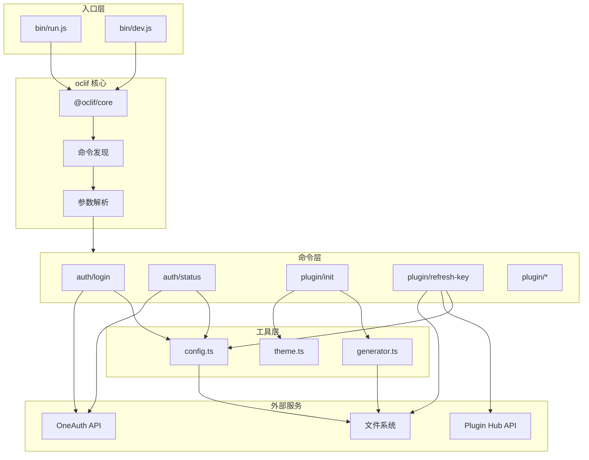
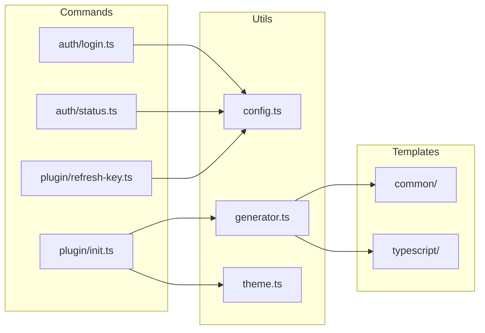
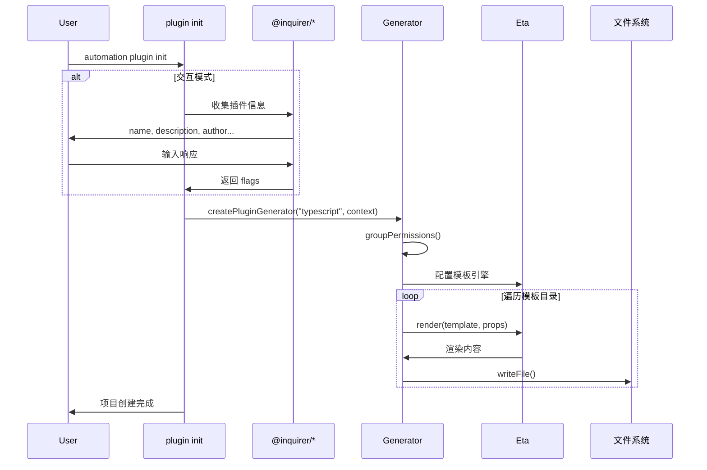
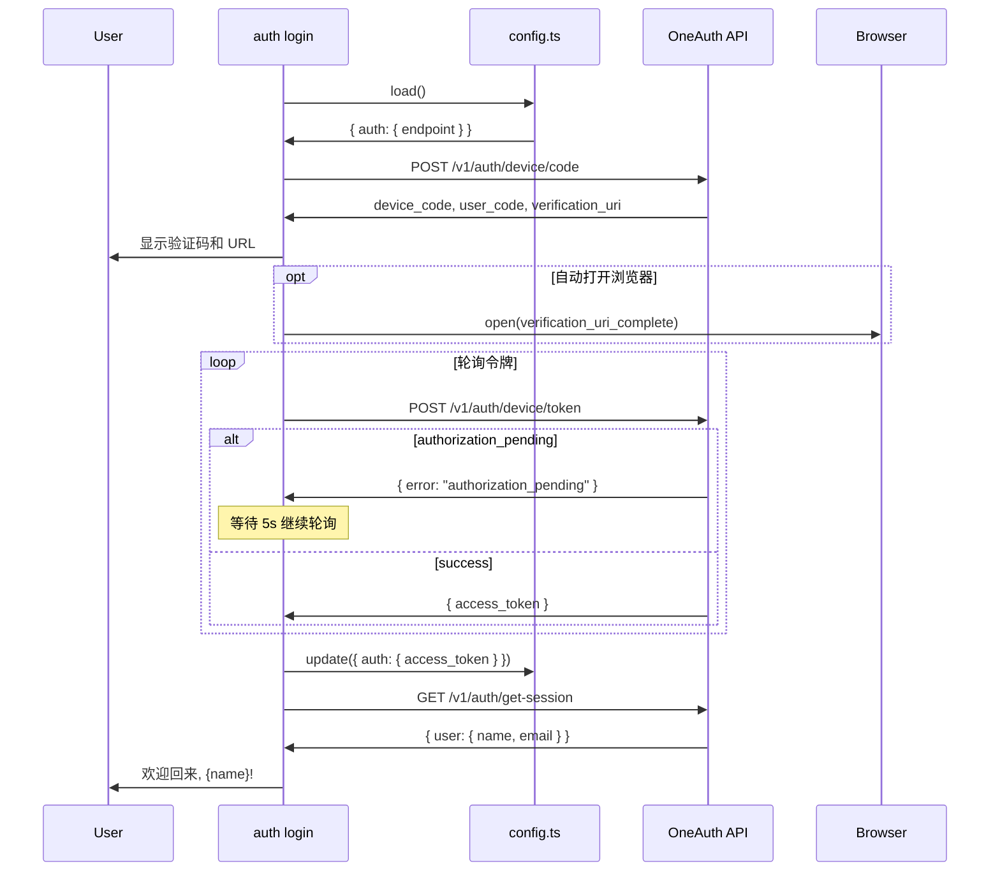

# Automation Plugin CLI - Architecture

Choiceform Automation 平台的插件开发命令行工具。

## 概述

本项目是一个基于 [oclif](https://oclif.io/) 框架构建的 CLI 工具，用于创建、开发、打包和发布 Choiceform Automation 平台插件。

### 主要功能

| 功能 | 命令 | 状态 |
|------|------|------|
| 设备授权登录 | `automation auth login` | ✅ 完成 |
| 鉴权状态查询 | `automation auth status` | ✅ 完成 |
| 初始化插件项目 | `automation plugin init` | ✅ 完成 |
| 刷新调试密钥 | `automation plugin refresh-key` | ✅ 完成 |
| 校验和计算 | `automation plugin checksum` | 🚧 待实现 |
| 打包插件 | `automation plugin pack` | 🚧 待实现 |
| 权限管理 | `automation plugin permission` | 🚧 待实现 |
| 本地运行 | `automation plugin run` | 🚧 待实现 |

### 技术栈

| 层级 | 技术 |
|------|------|
| CLI 框架 | oclif v4 |
| 语言 | TypeScript (ESM) |
| 模板引擎 | Eta |
| 交互组件 | @inquirer/* |
| 数据验证 | Zod |
| 测试 | Mocha + Chai |
| 代码质量 | Biome |

## 目录结构

```
automation-plugin-cli/
├── bin/                    # CLI 入口脚本
│   ├── run.js              # 生产入口
│   └── dev.js              # 开发入口 (ts-node)
├── src/                    # 源代码
│   ├── index.ts            # 主入口
│   ├── commands/           # oclif 命令
│   │   ├── auth/           # 认证命令组
│   │   └── plugin/         # 插件命令组
│   ├── templates/          # Eta 模板
│   │   ├── common/         # 通用模板
│   │   └── typescript/     # TS 插件模板
│   └── utils/              # 工具模块
├── test/                   # 单元测试
│   ├── commands/
│   └── utils/
└── dist/                   # 编译输出
```

## 架构图

### 命令执行流程



### 模块依赖关系



### 插件初始化流程



### 设备授权登录流程



## 模块详情

各模块详细说明请参阅对应目录的 OVERVIEW.md:

| 目录 | 文档 |
|------|------|
| `src/` | [src/OVERVIEW.md](src/OVERVIEW.md) |
| `src/commands/` | [src/commands/OVERVIEW.md](src/commands/OVERVIEW.md) |
| `src/commands/auth/` | [src/commands/auth/OVERVIEW.md](src/commands/auth/OVERVIEW.md) |
| `src/commands/plugin/` | [src/commands/plugin/OVERVIEW.md](src/commands/plugin/OVERVIEW.md) |
| `src/templates/` | [src/templates/OVERVIEW.md](src/templates/OVERVIEW.md) |
| `src/utils/` | [src/utils/OVERVIEW.md](src/utils/OVERVIEW.md) |
| `test/` | [test/OVERVIEW.md](test/OVERVIEW.md) |

## 设计模式

### 1. 命令模式 (Command Pattern)

oclif 框架采用命令模式，每个命令是一个继承 `Command` 基类的类：

```typescript
export default class MyCommand extends Command {
  static description = "..."
  static flags = { ... }
  async run() { ... }
}
```

### 2. 工厂模式 (Factory Pattern)

`generator.ts` 使用工厂函数创建不同语言的生成器：

```typescript
createPluginGenerator(type, context) // -> PluginGenerator
```

### 3. 策略模式 (Strategy Pattern)

`PluginGenerator` 接口定义统一行为，不同语言实现各自策略：

```typescript
interface PluginGenerator {
  generate(): Promise<void>
}
```

## 配置文件

### oclif 配置 (`package.json`)

```json
{
  "oclif": {
    "bin": "automation",
    "commands": "./dist/commands",
    "plugins": [
      "@oclif/plugin-autocomplete",
      "@oclif/plugin-help",
      "@oclif/plugin-version"
    ],
    "topicSeparator": " "
  }
}
```

### 本地配置 (`~/.choiceform/atomemo.json`)

```json
{
  "auth": {
    "endpoint": "https://oneauth.choiceform.io",
    "access_token": "eyJ..."
  },
  "hub": {
    "endpoint": "https://automation-plugin-api.choiceform.io"
  }
}
```

## 待办事项

### 功能实现

- [ ] 实现 `plugin checksum` - 计算插件包校验和
- [ ] 实现 `plugin pack` - 打包插件为发布格式
- [ ] 实现 `plugin permission` - 交互式权限配置
- [ ] 实现 `plugin run` - 本地开发服务器
- [ ] 添加 `elixir` 插件模板
- [ ] 添加 `python` 插件模板

### 测试完善

- [ ] 添加 `auth login` 命令测试 (需 mock 网络)
- [ ] 完善 `plugin init` 交互模式测试
- [ ] 添加 `generator.ts` 单元测试
- [ ] 添加集成测试验证完整流程

### 代码改进

- [ ] `views.ts` 已弃用，考虑移除
- [ ] `plugin init` 的 `init.test.ts` 第二个测试断言为空，需修复
- [ ] 考虑为 `TypeScriptPluginGenerator` 添加进度输出
- [ ] 统一错误处理策略

### 文档

- [ ] 添加用户使用文档
- [ ] 添加插件开发指南
- [ ] 添加 API 参考文档
