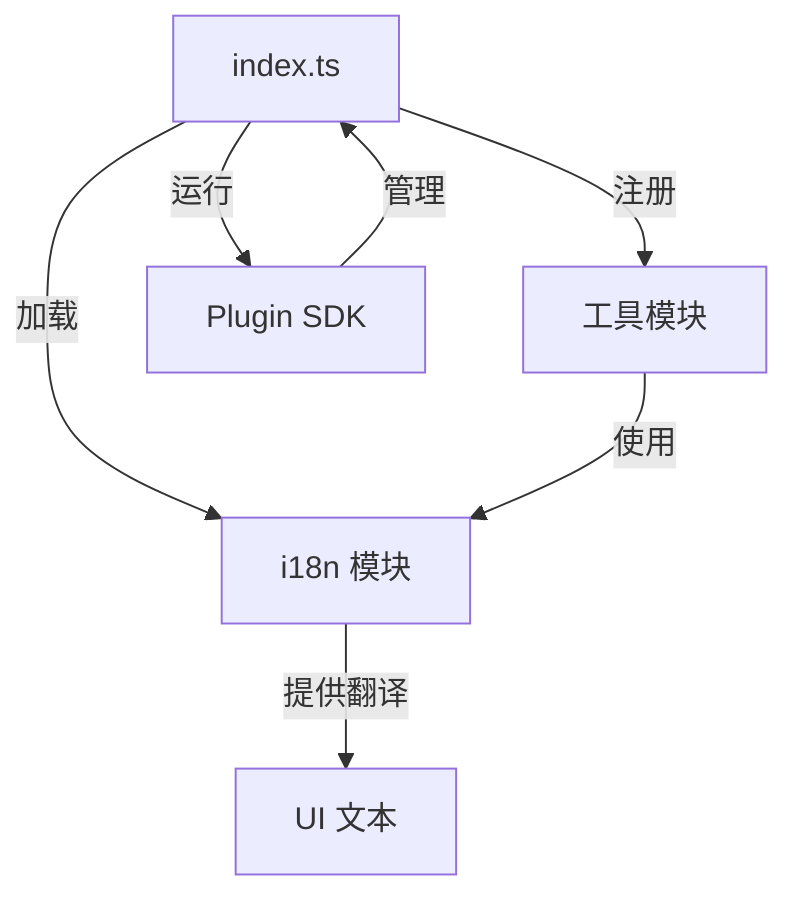
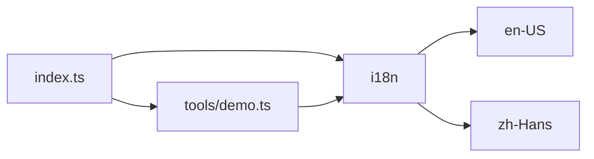
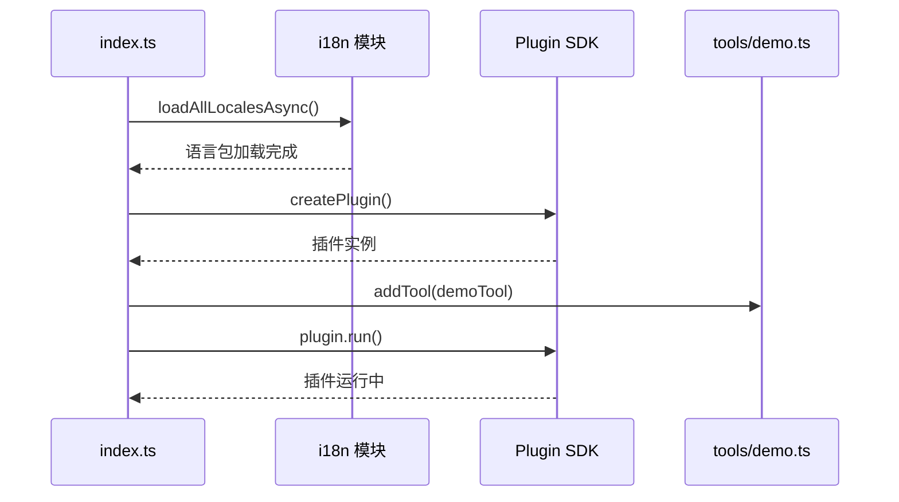

# 项目架构文档

**最后更新：** 2026-01-18

## 概述

这是一个基于 ChoiceOpen Automation Plugin SDK 的测试插件项目。插件提供工具执行功能，支持英文和简体中文两种语言。

## 技术栈

- **语言**: TypeScript
- **运行时**: Node.js / Bun
- **构建工具**: tsdown
- **国际化**: typesafe-i18n
- **测试框架**: Vitest
- **代码格式化**: Biome
- **SDK**: @choiceopen/automation-plugin-sdk-js

## 项目结构

```
testing-plugin/
├── src/                    # 源代码目录
│   ├── tools/             # 工具定义
│   │   └── demo.ts        # 演示工具
│   ├── i18n/              # 国际化
│   │   ├── en-US/         # 英文翻译
│   │   ├── zh-Hans/       # 中文翻译
│   │   ├── formatters.ts  # 格式化器
│   │   ├── i18n-node.ts   # Node.js 入口
│   │   ├── i18n-types.ts  # 类型定义（自动生成）
│   │   ├── i18n-util.ts   # 工具函数
│   │   ├── i18n-util.async.ts  # 异步加载
│   │   └── i18n-util.sync.ts   # 同步加载
│   ├── index.ts           # 插件入口
│   └── README.md          # 源码说明
├── tests/                 # 测试文件
│   └── index.test.ts      # 主测试文件（空）
├── dist/                  # 构建输出
└── .spec/                 # 架构文档
```

## 核心模块

### 1. 插件入口 (src/index.ts)

插件的主入口文件，负责：
- 异步加载所有国际化语言包
- 创建插件实例并配置基本信息（名称、描述、图标、作者等）
- 注册工具组件
- 启动插件服务

```typescript
const plugin = createPlugin({
  name: packageJSON.name,
  display_name: t("PLUGIN_DISPLAY_NAME"),
  description: t("PLUGIN_DESCRIPTION"),
  icon: "🎛️",
  author: "Choiceform",
  // ...
})

plugin.addTool(demoTool)
plugin.run()
```

### 2. 工具模块 (src/tools/)

定义插件提供的可执行工具。当前包含一个演示工具 `demo-tool`：

- **名称**: demo-tool
- **图标**: 🧰
- **参数**:
  - `location` (string, required) - 位置参数，支持表达式

工具执行时返回包含位置信息的消息。

### 3. 国际化模块 (src/i18n/)

基于 typesafe-i18n 实现类型安全的国际化系统：

**支持的语言**：
- 英文（en-US）
- 简体中文（zh-Hans）

**翻译键**：
- `PLUGIN_DISPLAY_NAME` - 插件显示名称
- `PLUGIN_DESCRIPTION` - 插件描述
- `DEMO_TOOL_DISPLAY_NAME` - 演示工具显示名称
- `DEMO_TOOL_DESCRIPTION` - 演示工具描述
- `LOCATION_DISPLAY_NAME` - 位置参数显示名称
- `LOCATION_HINT` - 位置参数提示
- `LOCATION_PLACEHOLDER` - 位置参数占位符

## 数据流



## 模块依赖关系



## 构建流程

1. **开发模式**: `bun run dev`
   - 使用 tsdown watch 模式监听文件变化
   - 同时运行 typesafe-i18n 生成类型定义

2. **构建**: `bun run build`
   - 使用 tsdown 编译 TypeScript
   - 生成类型定义文件（.d.ts）
   - 输出到 `dist/` 目录

3. **测试**: `bun run test`
   - 使用 Vitest 运行测试用例

4. **类型检查**: `bun run typecheck`
   - 使用 tsc 进行类型检查

## 国际化机制

插件使用 typesafe-i18n 实现类型安全的国际化：

1. **翻译文件**: 位于 `src/i18n/{locale}/index.ts`
2. **类型生成**: 自动生成 `i18n-types.ts` 包含所有翻译键的类型
3. **加载方式**:
   - 同步加载（`i18n-util.sync.ts`）
   - 异步加载（`i18n-util.async.ts`，用于动态导入）
4. **使用方式**: 通过 `t()` 函数获取翻译，编译时类型检查

## 插件注册流程



## 待办事项

### 功能改进
- [ ] 完善测试用例（`tests/index.test.ts` 当前为空）
- [ ] 添加更多工具支持
- [ ] 实现工具的实际业务逻辑（当前仅为演示）
- [ ] 添加凭证管理功能（如需要 API 密钥）
- [ ] 添加模型定义功能（如需要 AI 模型支持）

### 代码质量
- [ ] 添加错误处理机制
- [ ] 完善类型定义和文档注释
- [ ] 添加代码示例和使用文档

### 国际化
- [ ] 考虑添加更多语言支持
- [ ] 完善翻译文本的内容

### 构建和部署
- [ ] 配置 CI/CD 流程
- [ ] 添加版本管理和发布流程
- [ ] 优化构建产物大小
